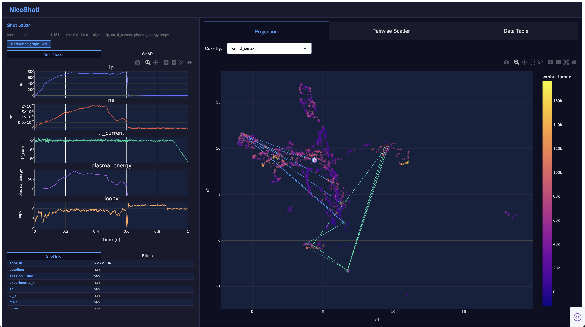

# NiceShot!

An interactive dashboard for exploring tokamak plasma shot data. Point it at a shot-statistics file and get an instant browser UI for slicing, visualising, and comparing shots.




---

## Features

- **Projection** — UMAP or PCA scatter of every shot, coloured by any column. Backed by a content-hash cache so reloads are instant.
- **Pairwise scatter** — any two numeric columns plotted against each other, with linear/log axis toggles.
- **Data table** — sortable, virtualized table with shot-ID search and cross-highlight with the scatter plots.
- **Time traces** — per-shot signal plots loaded on click. Supports local parquet/CSV files, live UDA, and live SAL backends.
- **Filters** — up to 6 simultaneous column filters combinable with AND / OR logic. All plots update live.
- **SHAP decision plots** — per-shot feature attribution rendered inline (optional, requires `--shap-data`).
- **Reference graph** — overlay the full reference-shot lineage on any scatter plot (optional, requires `reference_shot_col` in config).


---

## Requirements

- Python ≥ 3.12
- [uv](https://github.com/astral-sh/uv)

---

## Install

```sh
git clone <repo>
cd nice_shot
uv sync                      # core dependencies
uv sync --extra shap         # + SHAP plots, xarray, matplotlib
```

---

## Run

```sh
uv run nice-shot --shot-data path/to/shot_stats.parquet
```

Open **http://localhost:8050** in a browser.

On first run, UMAP/PCA is computed and cached. Subsequent starts are instant unless the data file or `umap_features` config changes.

### Common flags

| Flag | Default | Description |
|------|---------|-------------|
| `--shot-data PATH` | `outputs/shot_stats.parquet` | Shot statistics file (`.csv` or `.parquet`) |
| `--config PATH` | `nice_shot/config.yaml` | YAML config file |
| `--data-dir PATH` | `data/mastu/` | Directory of per-shot files (parquet backend) |
| `--projection PATH` | — | Pre-computed 2-D embedding; skips UMAP/PCA entirely |
| `--shap-data PATH` | — | SHAP values NetCDF (`.nc`); enables the SHAP tab |
| `--port PORT` | `8050` | Port to listen on |
| `--no-debug` | — | Disable Dash hot-reload |

---

## Configuration

Edit `nice_shot/config.yaml` (or pass `--config` to point elsewhere):

```yaml
backend: parquet        # parquet | uda | sal

signals:                # columns shown in the time-trace panel
  - ip
  - ne
  - dalpha

time_window:
  min_time: 0.0
  max_time: 1.0

projection_method: umap # umap | pca

umap_features:          # omit to use all numeric columns
  - ip_max
  - ne_max
  - bt_max

reference_shot_col: reference__number   # omit to hide the feature
```

---

## Data

**Shot statistics file** (`--shot-data`) — a flat `.parquet` or `.csv` with one row per shot. The shot ID column is detected automatically (`shot_id`, `shot`, `pulse`, `number`, …).

**Per-shot traces** (`--data-dir`) — one `.parquet` or `.csv` per shot, laid out as:
```
<data-dir>/<any-subdir>/<shot_id>.parquet
```
Each file needs a `time` column and one column per configured signal.

**Pre-computed projection** (`--projection`) — a `.npy` (shape `(n,2)` or `(n,3)`), `.csv`, or `.parquet` with shot ID and two coordinate columns.

**SHAP values** (`--shap-data`) — an `xarray` NetCDF file with `shot_id` and `feature` dimensions.

See [`docs/data-formats.md`](docs/data-formats.md) for full schema details.

---

## Docs

```sh
uv run --dev zensical serve
```

Opens the full documentation at **http://localhost:8000**.
