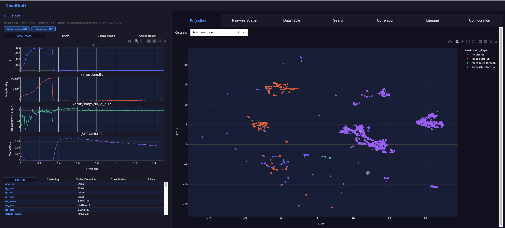

# NiceShot!

An interactive dashboard for exploring tokamak plasma shot data.

Point it at a shot-statistics file and it gives you:

- **Projection view** — UMAP or PCA scatter of every shot, coloured by any column
- **Pairwise scatter** — any two numeric columns plotted against each other
- **Correlation** — Pearson correlation heatmap for any selection of numeric columns
- **Data table** — sortable, searchable shot records with CSV export
- **Time traces** — per-shot signal traces loaded on click (parquet, UDA, or SAL backends)
- **Clustering** — K-Means, DBSCAN, or Agglomerative on any numeric columns; results colour the scatter plots with user-defined class names
- **Cluster centroid traces** — averaged time-series per cluster, updated live as class names change
- **Outlier detection** — Isolation Forest or Local Outlier Factor; outliers highlighted on scatter plots with sample traces shown automatically
- **Classification** — Gradient Boosting, Random Forest, or Gaussian Process trained on a target column; results colour the scatter plots and can show a decision-surface background
- **SHAP decision plots** — per-shot feature attribution, for a supplied SHAP file or for a trained classifier (optional)
- **Reference graph** — reference-shot relationships overlaid on scatter plots (optional)
- **Lineage changes** — which variables changed between a shot and the earlier shots in its reference lineage (optional)

---

## Contents

- [Quickstart](quickstart.md) — install and run in five minutes
- [Configuration](configuration.md) — full reference for `config.yaml` and CLI flags
- [Data Formats](data-formats.md) — what shot data, projection, and SHAP files must look like
- [Classification](classification.md) — training a supervised model on the shot table

---

## Requirements

- Python ≥ 3.12
- [uv](https://github.com/astral-sh/uv) for environment and dependency management
